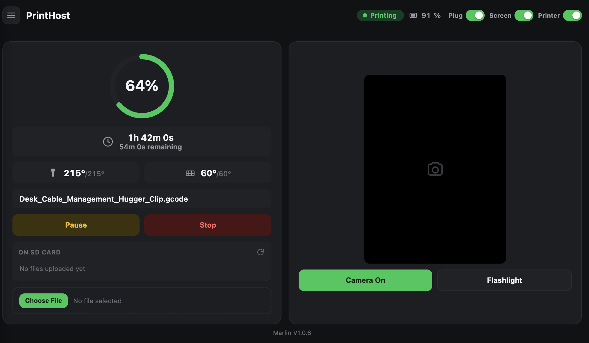

# PrintHost phone app

Turns a spare Android phone into the Wi-Fi dashboard/server half of PrintHost —
no Raspberry Pi required. Built for and tested against a **Creality Ender-3 V3 SE**
(Marlin V1.0.6), but the serial protocol layer is plain Marlin gcode and should
work with most Marlin-based printers with minor tweaks.

The printer itself is driven by a separate [ESP32-S3 board](../esp32-firmware)
(USB to the printer, camera, gcode storage); the phone runs this app to serve the
dashboard over your local Wi-Fi network and proxy the board's status/camera/logs.
No app installs beyond this one, no cloud account, no port forwarding — open the
phone's local IP in any browser on the same network.



## Features

- Upload and start/pause/resume/stop prints, with live temperature and progress
- Browse, select, and delete files already on the printer's SD card
- Live MJPEG camera preview + flashlight, using the phone's own camera as a
  webcam pointed at the print
- Manual filament unload and bed auto-leveling (both replicate the printer's
  own touchscreen macros, ported from the real Creality/DWIN firmware source
  rather than generic gcode)
- Optional Tapo smart-plug integration, if the printer's power runs through one
  (local KLAP protocol, no cloud round-trip)
- Optional Mac notification on print-finished/print-error, auto-discovered on
  the local subnet - no IP to configure
- Toast + sound notifications directly on the dashboard, for headless setups
  with no notification-capable machine nearby

## Setup

1. `./build.sh` (needs the Android SDK build-tools and `ANDROID_HOME` set;
   see the script for the exact tool versions it expects)
2. `adb install -r out/signed.apk`
3. Open `http://<phone-ip>:8899/` in a browser on the same network

For a fully unattended setup (phone left running by the printer, no one
around to tap "Allow" every time it reconnects), also install
[usbtap](https://github.com/Alexstyrkul/usbtap) - a small companion
accessibility service that auto-confirms that USB permission dialog and
powers the dashboard's screen-lock button. Optional otherwise: without it
you just tap the dialog yourself the first time each session.

Optional: run `mac-notify-listener.py` on a Mac on the same network for native
notifications - PrintHost auto-discovers it, no configuration needed.

Optional: for Tapo smart-plug control, create `assets/tapo.properties`
(gitignored, never commit it) with:

```
email=your-tp-link-account-email
password=your-tp-link-account-password
ip=192.168.x.x
```

This requires **Third-Party Compatibility** enabled in the Tapo app
(Device Settings → Third-Party Services) - without it, the plug's local API
stays locked to the official app/cloud only.

## What this is not

This is a personal project built through hands-on debugging against one
specific printer and phone, not a polished general-purpose product - expect
rough edges. It's a single Android app with no build variants, no CI, and no
test suite; changes are verified by hand against the real hardware.

## License

MIT - see [LICENSE](../LICENSE).

## See also

[../esp32-firmware](../esp32-firmware) - the ESP32-S3 firmware, and its
[HANDOFF doc](../esp32-firmware/docs/HANDOFF_ESP32_BRIDGE.md) for project state,
findings and next steps.
